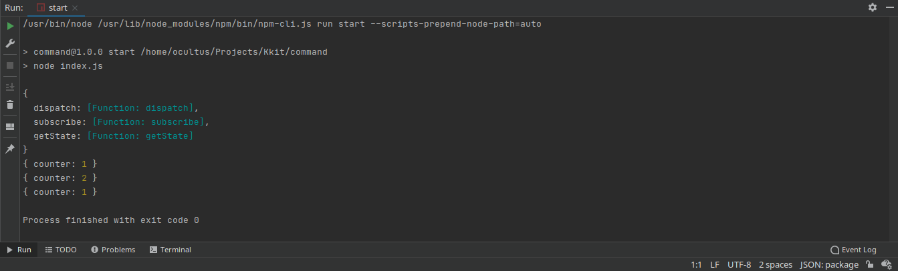

# [Redux](https://redux.js.org/) implementation
Javascript implementation of pattern Chain of Responsibility

---
### How to start

````
1. Clone this repository
2. $ yarn start or npm run start 
````
------

### Expected Result:

